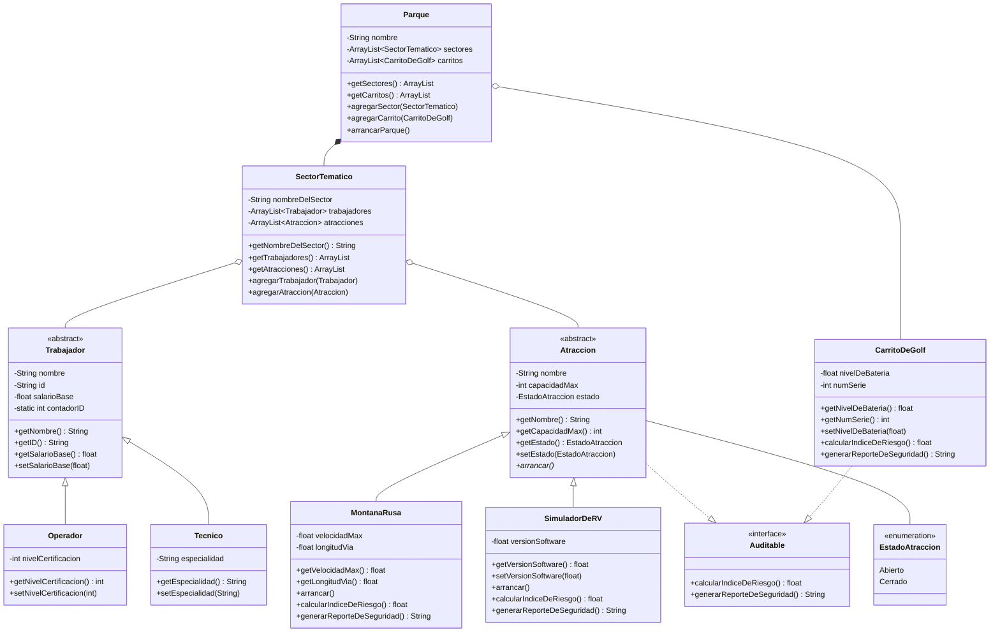

# Aventura-Cuantica diagrama UML

```mermaid
classDiagram
    class Auditable {
        <<interface>>
        +calcularIndiceDeRiesgo() float
        +generarReporteDeSeguridad() String
    }

    class Trabajador {
        <<abstract>>
        -String nombre
        -String id
        -float salarioBase
        -static int contadorID
        +getNombre() String
        +getID() String
        +getSalarioBase() float
        +setSalarioBase(float)
    }

    class Operador {
        -int nivelCertificacion
        +getNivelCertificacion() int
        +setNivelCertificacion(int)
    }

    class Tecnico {
        -String especialidad
        +getEspecialidad() String
        +setEspecialidad(String)
    }

    class Atraccion {
        <<abstract>>
        -String nombre
        -int capacidadMax
        -EstadoAtraccion estado
        +getNombre() String
        +getCapacidadMax() int
        +getEstado() EstadoAtraccion
        +setEstado(EstadoAtraccion)
        +arrancar()*
    }

    class MontanaRusa {
        -float velocidadMax
        -float longitudVia
        +getVelocidadMax() float
        +getLongitudVia() float
        +arrancar()
        +calcularIndiceDeRiesgo() float
        +generarReporteDeSeguridad() String
    }

    class SimuladorDeRV {
        -float versionSoftware
        +getVersionSoftware() float
        +setVersionSoftware(float)
        +arrancar()
        +calcularIndiceDeRiesgo() float
        +generarReporteDeSeguridad() String
    }

    class CarritoDeGolf {
        -float nivelDeBateria
        -int numSerie
        +getNivelDeBateria() float
        +getNumSerie() int
        +setNivelDeBateria(float)
        +calcularIndiceDeRiesgo() float
        +generarReporteDeSeguridad() String
    }

    class SectorTematico {
        -String nombreDelSector
        -ArrayList~Trabajador~ trabajadores
        -ArrayList~Atraccion~ atracciones
        +getNombreDelSector() String
        +getTrabajadores() ArrayList
        +getAtracciones() ArrayList
        +agregarTrabajador(Trabajador)
        +agregarAtraccion(Atraccion)
    }

    class Parque {
        -String nombre
        -ArrayList~SectorTematico~ sectores
        -ArrayList~CarritoDeGolf~ carritos
        +getSectores() ArrayList
        +getCarritos() ArrayList
        +agregarSector(SectorTematico)
        +agregarCarrito(CarritoDeGolf)
        +arrancarParque()
    }

    class EstadoAtraccion {
        <<enumeration>>
        Abierto
        Cerrado
    }

    Trabajador <|-- Operador
    Trabajador <|-- Tecnico
    Atraccion <|-- MontanaRusa
    Atraccion <|-- SimuladorDeRV
    Atraccion ..|> Auditable
    CarritoDeGolf ..|> Auditable
    Parque *-- SectorTematico
    SectorTematico o-- Trabajador
    SectorTematico o-- Atraccion
    Parque o-- CarritoDeGolf
    Atraccion -- EstadoAtraccion
```
